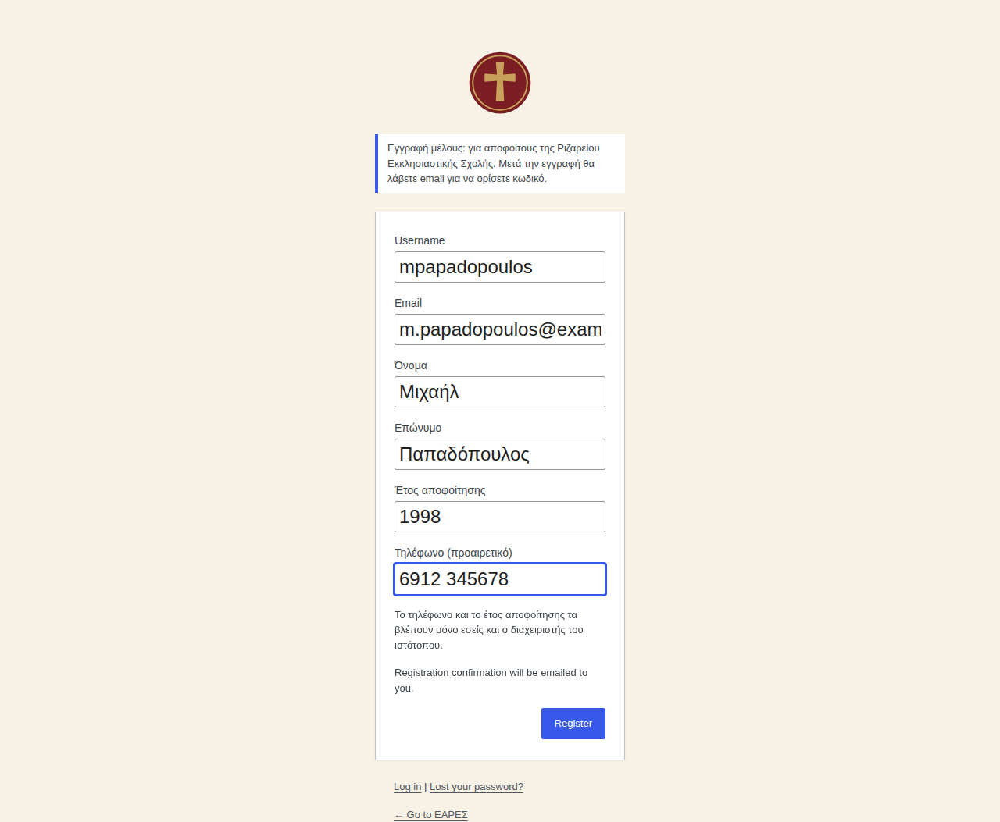
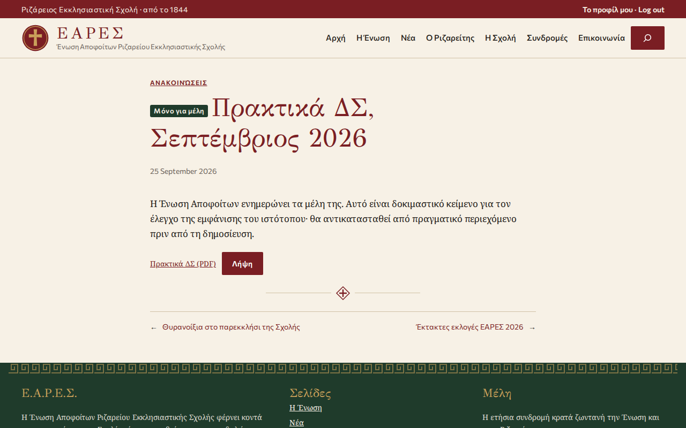
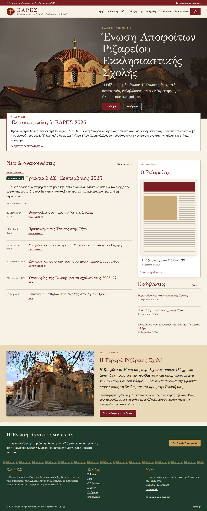

# EARES: a hardened, reproducible WordPress platform for an alumni association

[](https://github.com/itheCreator1/eares/actions/workflows/ci.yml)

## Abstract

This repository contains the complete, version-controlled definition of the website of the Rizarios Ecclesiastical School Alumni Association (ΕΑΡΕΣ, Ένωση Αποφοίτων Ριζαρείου Εκκλησιαστικής Σχολής). The system is a WordPress installation specified as code. Everything except content lives in git: the service topology, runtime configuration, access-control model, security controls, presentation layer and operational procedures. A single idempotent script rebuilds it on any host running Docker Compose.

The design rests on three commitments:
1. **The browser may change content but never code.**
2. **The access-control model mirrors the organisation.** A small staff administers the site for a membership of roughly one hundred alumni.
3. **Every security-relevant property is verified end to end, on every change**, against a freshly built stack.

This document describes the architecture, the access-control and security models, the members' area, the presentation layer, operations and the verification method. Greek-language guides for the two groups of users are in [`docs/`](#9-user-documentation).

---

## Contents

1. [Introduction](#1-introduction)
2. [System architecture](#2-system-architecture)
3. [Access-control model](#3-access-control-model)
4. [Security measures](#4-security-measures)
5. [The members' area](#5-the-members-area)
6. [Presentation layer](#6-presentation-layer)
7. [Operations](#7-operations)
8. [Verification](#8-verification)
9. [User documentation](#9-user-documentation)
10. [Repository structure](#10-repository-structure)
11. [Pre-deployment checklist](#11-pre-deployment-checklist)
12. [References](#references)

---

## 1. Introduction

The Rizarios Ecclesiastical School has educated students since 1844. Its alumni association keeps graduates in contact through news, events, elections and its newspaper, *The Rizareitis* (Ο Ριζαρείτης). The association's previous website served this purpose for many years. It combined public information, a members' login and an editorial workflow on an ageing content-management system.

The replacement addresses three requirements:

- **R1: Reproducibility.** The site must be rebuildable from the repository alone, so that no configuration exists only in a database or in someone's memory.
- **R2: Proportionate security.** The administrators are volunteers. The controls must prevent common compromises, namely credential stuffing, privilege escalation, code injection through the dashboard and user enumeration, without imposing procedures the organisation cannot sustain.
- **R3: Fitness for the actual user population.** Two to five staff members publish all content and look after accounts. About one hundred alumni sign in to read material intended for members. The general public reads everything else.

---

## 2. System architecture

### 2.1 Stack

| Layer | Component |
|---|---|
| Application | WordPress 7.1 on PHP 8.3 with Apache (`wordpress:7.1-php8.3-apache`) |
| Database | MariaDB 11.4 |
| Command-line administration | wp-cli 2.12 in a one-shot container |
| Mail (development) | Mailpit, which captures all outgoing mail |
| Database browser (optional) | Adminer, behind a Compose profile |

All image tags are pinned. Upgrading the `wordpress` image upgrades PHP and Apache only. WordPress core resides in a persistent volume and changes only through `scripts/update.sh` (§7.2).

### 2.2 Topology

The services communicate over two Docker networks:
- **`internal`** is declared `internal: true` and therefore has no route to the Internet. The database is attached only to this network.
- **`web`** gives the application, wp-cli and Mailpit outbound access, for updates and mail.

Every published port binds to `127.0.0.1`. In production, public exposure is the responsibility of a reverse proxy the operator controls (§4.4).

### 2.3 Configuration as code

Site behaviour is defined in four places, all under version control:

1. **`docker-compose.yml`** injects `wp-config.php` directives:
   - `DISALLOW_FILE_EDIT` is true;
   - `DISALLOW_FILE_MODS` is true except under wp-cli;
   - core auto-updates are disabled;
   - `FORCE_SSL_ADMIN` is set;
   - HTTPS detection behind a trusted proxy is configured.
2. **Must-use plugins** (`wp-content/mu-plugins/`) implement every site-specific behaviour. WordPress loads them unconditionally, and they cannot be deactivated from the dashboard.
3. **The block theme** (`wp-content/themes/eares/`) holds the presentation layer (§6).
4. **Idempotent scripts** (`scripts/`) install, configure, update, back up, seed and test the site. `setup.sh` checks before it changes anything, so repeated runs converge on the same state.

---

## 3. Access-control model

### 3.1 Roles

WordPress ships five roles designed for multi-author publications. They do not correspond to this organisation. The model is reduced to two roles, and the public is the implicit third tier:

| Tier | Role (slug) | Population | Capabilities |
|---|---|---|---|
| Staff | Administrator (`administrator`) | 2–5 people | Complete control of content, accounts and settings; may reset another user's two-factor configuration (`eares_reset_2fa`) |
| Members | Μέλος / Member (`eares_member`) | ≈100 alumni | `read`, `read_private_posts`, `read_private_pages`; nothing else |
| Public | none (anonymous) | everyone | Published content only |

The roles are defined in [`eares-roles.php`](wp-content/mu-plugins/eares-roles.php). Because WordPress persists roles in the database, the plugin treats its source as authoritative: whenever the constant `EARES_ROLES_VERSION` changes, the roles are rebuilt. The rebuild also migrates the accounts of retired roles before removing those roles:
- Editor and the former User Manager → Administrator;
- Author, Contributor and Subscriber → Member;
- the former Inactive role → no role.

### 3.2 Accounts without a role

WordPress normally lets a user without a role authenticate into an empty dashboard. Here such accounts are **refused at authentication**, before a session is created and before the second factor is requested. Their sessions are also destroyed the moment the last role is removed. The option "No role for this site" therefore acts as a reversible lock. Permanent removal is by deletion, with the account's content reassigned.

### 3.3 Design rationale

Earlier iterations separated editorial and account-management duties (Editor, User Manager) and carried the machinery to enforce that separation: hidden accounts, filtered role lists and a filtered audit log. The actual staff is small, and its members hold both duties, so the separation added complexity without reducing risk in practice. The present model accepts that **every staff account is fully privileged**. It compensates with the measures of §4: strongly recommended two-factor authentication, a complete audit log, and the impossibility of installing code from the browser.

---

## 4. Security measures

### 4.1 Threat model

The controls address:

- **T1:** online password guessing and credential stuffing;
- **T2:** takeover of an account whose password has leaked;
- **T3:** escalation from a stolen dashboard session to code execution on the server;
- **T4:** enumeration of login names;
- **T5:** automated abuse of the public sign-up form;
- **T6:** disclosure of members-only material to the public.

### 4.2 Controls

| Threat | Control | Implementation |
|---|---|---|
| T1 | Login throttling: 5 failures per username and IP, or 20 per IP, lock that IP for 15 minutes, even for the correct password. Lockouts are logged. | `eares-login-limit.php` |
| T2 | Optional two-factor authentication (authenticator app, backup codes, email codes), strongly recommended for staff. Administrators may reset another user's 2FA. The owner is notified by email and the reset is logged. No one can reset their own. | Two-Factor plugin; `eares-users-admin.php` |
| T2 | Application passwords disabled, since they would bypass 2FA | `eares-hardening.php` |
| T3 | No file editing or code installation from the dashboard; only wp-cli may modify code | `DISALLOW_FILE_EDIT`, `DISALLOW_FILE_MODS` in `docker-compose.yml` |
| T3 | XML-RPC disabled | `eares-hardening.php` |
| T4 | Author archives use an opaque slug (`/author/member-5a5385c0b6/`); `?author=N` does not reveal logins; REST `/wp/v2/users` and the users sitemap are unavailable to anyone who cannot edit posts | `eares-hardening.php` |
| T5 | Honeypot field; at most three sign-ups per IP per hour; server-side enforcement of the Member role regardless of submitted fields | `eares-registration.php` |
| T6 | Private visibility for posts and pages; members-only files outside the web-servable path (§5) | `eares-members.php` |

Account activity is recorded by Simple History and visible to Administrators only. The log includes logins, failures, lockouts, sign-ups, role changes, deletions and 2FA resets.

### 4.3 Personal data

Members' telephone numbers and graduation years are stored as user metadata. They are not registered with the REST API, are visible only to their owner and to Administrators, and are included in WordPress's personal-data export and erasure tools.

### 4.4 Deployment behind a proxy

When a reverse proxy terminates TLS, `TRUST_PROXY=1` makes WordPress honour `X-Forwarded-Proto` and take the client address from `X-Forwarded-For`. Without it, all clients would share the proxy's address, and a single attacker could lock everyone out. With it, but without the proxy being the only route to the application, the header could be forged. Both conditions are part of the checklist in §11.

---

## 5. The members' area

### 5.1 Registration

Alumni register at `wp-login.php?action=register` and become Members immediately. The form collects:
- username and email;
- first and last name, which become the public display name so the login name is never shown;
- graduation year (1844 to the current year);
- optionally, a telephone number.

WordPress emails a set-password link, which confirms the address, and notifies the Administrators.

*Figure 1. The registration form.*



The absence of an approval step is a deliberate choice of the association. As a consequence, "members-only" means *authenticated-only*. It keeps material out of search engines and away from casual visitors, but not from anyone willing to register. Staff review new registrations, each of which is emailed and logged, and delete implausible accounts.

### 5.2 Members-only posts and pages

Staff use WordPress's native *Private* status. Core already restricts private items to users holding `read_private_posts` or `read_private_pages`, and excludes them from feeds, sitemaps and anonymous REST responses. The site replaces the default "Private:" title prefix with a *Μόνο για μέλη* label.

*Figure 2. A members-only post as seen by a signed-in member, with a protected PDF attached.*



### 5.3 Members-only files

A private post does not protect its attachments, whose URLs remain publicly retrievable. An attachment marked *Μόνο για μέλη* is therefore handled as follows:
1. The file and all its generated sizes are moved into `uploads/eares-members/`, which carries a `Require all denied` `.htaccess`.
2. Its URL is rewritten to `/?eares_file=<id>`. That handler streams the file to users with `read_private_posts` and redirects everyone else to the login page.
3. File blocks are rewritten on output, so a post always links to the file's current address, whichever order the file was inserted and protected in.

### 5.4 Members' experience

Members see the site, not the dashboard:
- the toolbar is suppressed;
- login lands on the home page;
- in `wp-admin` only the profile screen is reachable;
- the header offers *Το προφίλ μου · Αποσύνδεση* ("My profile · Log out") to members and *Είσοδος μελών · Εγγραφή* ("Members' login · Sign up") to visitors.

---

## 6. Presentation layer

The block theme `eares` translates the character of the association's historic premises into a restrained contemporary design.

**Palette and typography.** The colours are drawn from photographs of the school church: crimson from the brick arches, limestone from the walls, and cypress green from the courtyard trees. Headings use GFS Didot (Greek Font Society), body text Noto Serif, and interface elements Commissioner. All three cover monotonic and polytonic Greek. The fonts are self-hosted, and the WordPress emoji script is removed, so a page view makes no third-party requests.

**Front page.** The front page is organised as a bulletin board, in order:
1. a hero image of the church dome;
2. pinned announcements;
3. the latest news beside the newest issue of *The Rizareitis* and the upcoming events;
4. the association's welcome text, in which the school's age is computed rather than hard-coded;
5. a membership call to action.

*Figure 3. The front page.*



**Structure.**
- Design tokens are in `theme.json`.
- Templates and template parts are in `templates/` and `parts/`.
- Composite sections and editor-insertable patterns are in `patterns/`: board-members grid, ornamental divider, membership band.
- Residual CSS is in `assets/theme.css`.

Photographs are derived from the originals in `assets/pictures/` (10–12 MB each) by `scripts/optimize-photo.sh`, which produces WebP files of 150–290 KB. [`docs/site-map.md`](docs/site-map.md) maps the former site's sections onto the new structure.

---

## 7. Operations

### 7.1 Installation

The only prerequisite is Docker with Compose.

```sh
cp .env.example .env        # then set every password
docker compose up -d        # WordPress, MariaDB, Mailpit
scripts/setup.sh            # install and configure (idempotent)
scripts/seed-users.sh       # optional, local only: fake test users
scripts/seed-content.sh     # optional, local only: fake sample content
scripts/smoke-test.sh       # optional: end-to-end verification
```

| URL | Service |
|---|---|
| http://localhost:8080 | Public site |
| http://localhost:8080/wp-admin | Dashboard (credentials from `.env`) |
| http://localhost:8025 | Mailpit, which captures all outgoing mail |
| http://localhost:8081 | Adminer (`docker compose --profile tools up -d adminer`) |

`setup.sh` installs core, the Greek language pack, the Two-Factor and Simple History plugins, the settings, the theme and the site skeleton:
- categories;
- menu pages, with explicit *Προς συμπλήρωση* ("to be completed") placeholders rather than invented facts;
- the static front page;
- page header images.

It never overwrites content that already exists. Outside `WP_ENVIRONMENT_TYPE=local`, it refuses the example passwords.

### 7.2 Updates

WordPress core, plugins and translations change only through wp-cli:

```sh
scripts/backup.sh && scripts/update.sh
```

Run this at least monthly, and immediately after a security release.

### 7.3 Backup and restore

`scripts/backup.sh` writes `backups/db-<time>.sql.gz` and `backups/uploads-<time>.tar.gz`. The uploads archive includes members-only files. Core and plugins are excluded because `setup.sh` reinstalls them. Restoring into a running stack:

```sh
set -a; source .env; set +a
gunzip -c backups/db-<time>.sql.gz \
  | docker compose exec -T -e MYSQL_PWD="$DB_ROOT_PASSWORD" db mariadb -uroot "$DB_NAME"
docker compose exec -T -u www-data wordpress tar -C /var/www/html/wp-content -xz \
  < backups/uploads-<time>.tar.gz
```

Backups must be copied off the host.

### 7.4 Mail

Outgoing mail uses SMTP with the `SMTP_*` settings, and STARTTLS whenever the server offers it. Registration, password reset and emailed 2FA codes all depend on reliable delivery.

### 7.5 Language

Greek is the site language. Each user may switch their own dashboard to English from their profile. Strings introduced by this project are in Greek. The Member role name follows the user's language.

---

## 8. Verification

Three layers of checks run locally and in continuous integration ([`.github/workflows/ci.yml`](.github/workflows/ci.yml)):

```sh
composer install && vendor/bin/phpcs   # WordPress Coding Standards, PHP compatibility
shellcheck scripts/*.sh                # shell scripts
scripts/smoke-test.sh                  # end-to-end; needs setup, seed-users, seed-content
```

The smoke test exercises a running site through wp-cli and HTTP. It asserts:

- **Roles:** the role set is exactly {Administrator, Member}; Member capabilities are minimal; role-less accounts are refused at login; nobody can reset their own 2FA.
- **Hardening:** XML-RPC refused; REST `/users` unavailable anonymously and to Members; `?author=N` does not disclose logins; no author slug equals a login name.
- **Registration:** a forged `role=administrator` still yields a Member; the honeypot, the required graduation year and the per-IP limit each reject.
- **Members' area:** a private post returns 404 anonymously and 200 to a Member; a protected file redirects anonymously, is refused at its direct uploads URL (403) and is served to a Member; a file block inserted before protection links to the protected URL; a Member's `wp-admin` request lands on the profile.
- **Theme:** templates render; the sticky notice appears; there are no third-party requests.
- **Login throttling:** the correct password is refused after five failures.

CI runs lint, then builds a stack from nothing, installs, seeds, runs the smoke test and takes a backup, on every push and pull request.

---

## 9. User documentation

Step-by-step guides in Greek, with screenshots, written for printing or publication as help pages:

| Guide | Audience |
|---|---|
| [`docs/odigos-melous.md`](docs/odigos-melous.md) | Members: registration, sign-in, members-only content, profile, password recovery |
| [`docs/odigos-diacheiristi.md`](docs/odigos-diacheiristi.md) | Staff (Administrators): publishing, members-only content and files, accounts, 2FA resets, personal data, operations |
| [`docs/2fa-odigos.md`](docs/2fa-odigos.md) | Everyone: enabling two-factor authentication |

---

## 10. Repository structure

| Path | Purpose |
|---|---|
| `docker-compose.yml` | Services, pinned images, networks, `wp-config` hardening |
| `wp-content/mu-plugins/eares-roles.php` | The two roles, their capabilities and the migration from retired roles |
| `wp-content/mu-plugins/eares-registration.php` | Public sign-up: fields, validation, honeypot, per-IP limit, logging |
| `wp-content/mu-plugins/eares-members.php` | Members-only posts and files; members' front-end-only experience |
| `wp-content/mu-plugins/eares-users-admin.php` | Last-login tracking; 2FA and last-login columns; *12+ months* view; Reset 2FA; allowed 2FA providers; the login block for role-less accounts; activity-log visibility |
| `wp-content/mu-plugins/eares-login-limit.php` | Login throttling |
| `wp-content/mu-plugins/eares-hardening.php` | Registration role enforcement; XML-RPC and application passwords off; user-enumeration controls; opaque author slugs |
| `wp-content/mu-plugins/eares-profile.php` | Private telephone and graduation-year fields; personal-data exporter and eraser; simplified profile |
| `wp-content/mu-plugins/eares-mail.php` | SMTP configuration from the environment |
| `wp-content/themes/eares/` | The block theme |
| `scripts/setup.sh`, `scripts/setup-content.php` | Installation, configuration and site skeleton |
| `scripts/update.sh`, `scripts/backup.sh` | Updates; backups |
| `scripts/seed-users.*`, `scripts/seed-content.*` | Fake users and content for development; refuse to run in production |
| `scripts/smoke-test.*` | End-to-end verification |
| `scripts/optimize-photo.sh` | Photograph derivation for the theme |
| `docs/` | User guides, site map, screenshots |
| `.github/workflows/ci.yml` | Continuous integration |

---

## 11. Pre-deployment checklist

- [ ] Configure a production SMTP provider (`SMTP_*`) and confirm that a test registration's email arrives.
- [ ] Set `WP_ENVIRONMENT_TYPE=production` and `blog_public=1`, and replace every `change-me` password.
- [ ] Serve over HTTPS with `FORCE_SSL_ADMIN=1`. Behind a proxy, set `TRUST_PROXY=1` and ensure the application is reachable only through it.
- [ ] If a server other than the bundled Apache serves `/wp-content/uploads/` directly, deny `/wp-content/uploads/eares-members/` there as well.
- [ ] Have at least two Administrators, each with two-factor authentication enabled.
- [ ] Schedule `scripts/backup.sh` nightly with off-host copies, and `scripts/update.sh` monthly.
- [ ] Verify the completeness of the Two-Factor plugin's Greek translation.
- [ ] Replace the *Προς συμπλήρωση* placeholders: history, board, subscription amount and IBAN, contact details.

---

## References

1. WordPress Developer Resources, *Roles and Capabilities*. https://developer.wordpress.org/plugins/users/roles-and-capabilities/
2. WordPress Developer Resources, *Post Status: Private*. https://wordpress.org/documentation/article/post-status/
3. WordPress Developer Resources, *Editing wp-config.php: Disable Plugin and Theme Update and Installation*. https://developer.wordpress.org/advanced-administration/wordpress/wp-config/
4. Two-Factor plugin. https://wordpress.org/plugins/two-factor/
5. Simple History plugin. https://wordpress.org/plugins/simple-history/
6. OWASP, *Authentication Cheat Sheet* (login throttling, account enumeration). https://cheatsheetseries.owasp.org/cheatsheets/Authentication_Cheat_Sheet.html
7. Greek Font Society, *GFS Didot*; Google, *Noto Serif*; *Commissioner*. All under the SIL Open Font License 1.1 (see `wp-content/themes/eares/assets/fonts/`).
8. Docker, *Compose file reference: networks (`internal`)*. https://docs.docker.com/reference/compose-file/networks/
