# Οδηγός για τους διαχειριστές του ιστότοπου της ΕΑΡΕΣ

> Για τα 2–5 άτομα που τρέχουν τον ιστότοπο: γράφουν και δημοσιεύουν, και φροντίζουν τους λογαριασμούς των μελών.
> Οι ονομασίες των κουμπιών δίνονται στα ελληνικά. Στην παρένθεση φαίνεται η αγγλική ονομασία, αν η οθόνη σας είναι στα αγγλικά.

## Ποιος βλέπει τι

| | Ποιοι | Τι μπορούν |
|---|---|---|
| **Διαχειριστής** (Administrator) | Εσείς: τα 2–5 άτομα της Ένωσης που τρέχουν τον ιστότοπο | Τα πάντα: περιεχόμενο, λογαριασμοί, ρυθμίσεις |
| **Μέλος** | Οι απόφοιτοι που έχουν κάνει εγγραφή | Βλέπουν και το περιεχόμενο **μόνο για μέλη** και αλλάζουν το προφίλ τους |
| **Επισκέπτης** | Όλοι οι άλλοι | Βλέπουν τον δημόσιο ιστότοπο |

Κάθε διαχειριστής μπορεί να κάνει **τα πάντα**, και να αλλάξει ή να σβήσει ό,τι έχουν κάνει οι άλλοι. Γι' αυτό:

- **Ενεργοποιήστε την [επαλήθευση δύο βημάτων](2fa-odigos.md).** Για τους διαχειριστές δεν είναι πολυτέλεια.
- Μην μοιράζεστε λογαριασμούς. Κάθε άτομο έχει τον δικό του, ώστε το Ιστορικό να δείχνει ποιος έκανε τι.

Τα μέλη έχουν τον δικό τους οδηγό: [Οδηγός για τα μέλη](odigos-melous.md).

---

## Μέρος Α: Περιεχόμενο

### Σύνδεση

1. Στην κόκκινη λωρίδα επάνω δεξιά πατήστε **Είσοδος μελών** και συνδεθείτε.
2. Ανοίγει ο **Πίνακας ελέγχου** (Dashboard). Αριστερά είναι το μενού. Τα περισσότερα που θα χρειαστείτε:
   - **Άρθρα** (Posts), **Πολυμέσα** (Media), **Σελίδες** (Pages), **Σχόλια** (Comments): το περιεχόμενο (Μέρος Α).
   - **Χρήστες** (Users): οι λογαριασμοί (Μέρος Β).

   Τα **Εμφάνιση** (Appearance) και **Ρυθμίσεις** (Settings) μην τα αλλάζετε χωρίς να ρωτήσετε όποιον έχει την τεχνική ευθύνη του ιστότοπου.

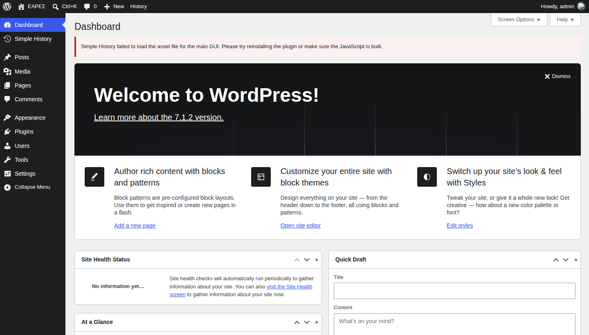

### Άρθρα ή σελίδες;

| | Άρθρο (Post) | Σελίδα (Page) |
|---|---|---|
| Για | Ειδήσεις, ανακοινώσεις, εκδηλώσεις, φύλλα του «Ριζαρείτη» | Μόνιμο περιεχόμενο: Η Ένωση, Η Σχολή, Συνδρομές, Επικοινωνία |
| Εμφανίζεται | Στα **Νέα** και στην αρχική, το νεότερο πρώτο | Στο μενού |
| Έχει | Ημερομηνία και κατηγορία | Τίποτα από τα δύο |

Σχεδόν πάντα θα γράφετε **άρθρο**.

### Νέο άρθρο, βήμα βήμα

1. Αριστερά πατήστε **Άρθρα → Προσθήκη νέου** (Posts → Add New Post).
2. Γράψτε τον **τίτλο** και από κάτω το κείμενο. Κάθε `Enter` ξεκινά νέα παράγραφο.
3. Στη δεξιά στήλη, στην καρτέλα **Άρθρο** (Post), ανοίξτε τις **Κατηγορίες** (Categories) και τσεκάρετε μία. Αν δεν βλέπετε τη δεξιά στήλη, πατήστε το τετράγωνο εικονίδιο επάνω δεξιά, δίπλα στο **Δημοσίευση**.

   | Κατηγορία | Για |
   |---|---|
   | **Νέα** | Γενικά νέα της Ένωσης και της Σχολής |
   | **Ανακοινώσεις** | Επίσημες ανακοινώσεις του ΔΣ |
   | **Εκδηλώσεις** | Εκδηλώσεις, με ημερομηνία και ώρα στο κείμενο |
   | **Ο Ριζαρείτης** | Ένα άρθρο για κάθε φύλλο της εφημερίδας (δείτε πιο κάτω) |

4. Πατήστε **Δημοσίευση** (Publish) επάνω δεξιά και ξανά **Δημοσίευση** για επιβεβαίωση.

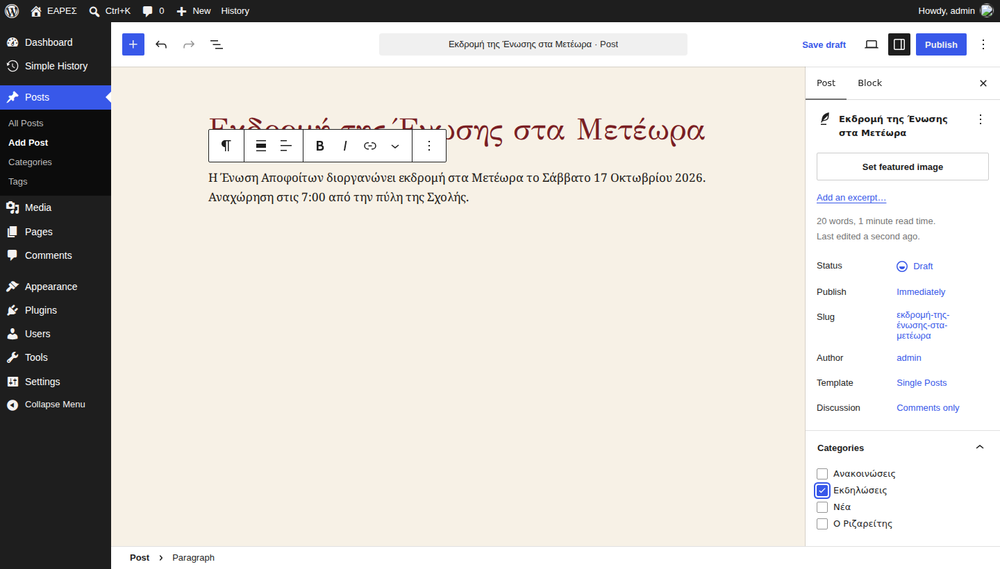

> Δεν είστε έτοιμοι; Πατήστε **Αποθήκευση πρόχειρου** (Save draft). Το άρθρο δεν φαίνεται πουθενά μέχρι να το δημοσιεύσετε.

#### Φωτογραφία του άρθρου

Η **Εικόνα άρθρου** (Featured image) φαίνεται στη λίστα των Νέων και στην κορυφή του άρθρου.

1. Στη δεξιά στήλη πατήστε **Ορισμός εικόνας άρθρου** (Set featured image).
2. Ανεβάστε φωτογραφία ή διαλέξτε από τη Βιβλιοθήκη.
3. Στο πεδίο **Εναλλακτικό κείμενο** (Alt text) περιγράψτε τη φωτογραφία σε μία πρόταση, π.χ. «Ο Μητροπολίτης με αποφοίτους στην αυλή της Σχολής». Το διαβάζουν όσοι δεν βλέπουν.
4. Πατήστε **Ορισμός εικόνας άρθρου**.

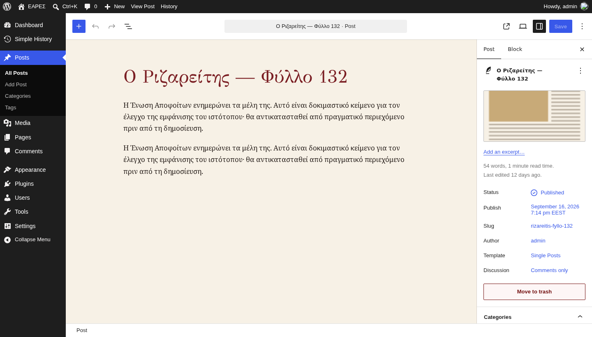

> Φωτογραφίες από το κινητό είναι μεγάλες, αλλά δεν πειράζει: ο ιστότοπος φτιάχνει μόνος του μικρότερα αντίγραφα.

### Καρφιτσωμένη ανακοίνωση στην αρχική

Για κάτι που **δεν πρέπει να χάσει κανείς**, π.χ. πρόσκληση σε Γενική Συνέλευση. Εμφανίζεται ακριβώς κάτω από τη μεγάλη φωτογραφία της αρχικής.

1. Στο άρθρο, στη δεξιά στήλη, πατήστε δίπλα στην **Κατάσταση** (Status).
2. Στο παράθυρο που ανοίγει, κάτω κάτω, τσεκάρετε **Καρφίτσωμα** (Sticky).
3. Πατήστε **Αποθήκευση** (Save).
4. Όταν περάσει η εκδήλωση, **ξετσεκάρετε** το ίδιο κουτάκι. Το άρθρο μένει στα Νέα.

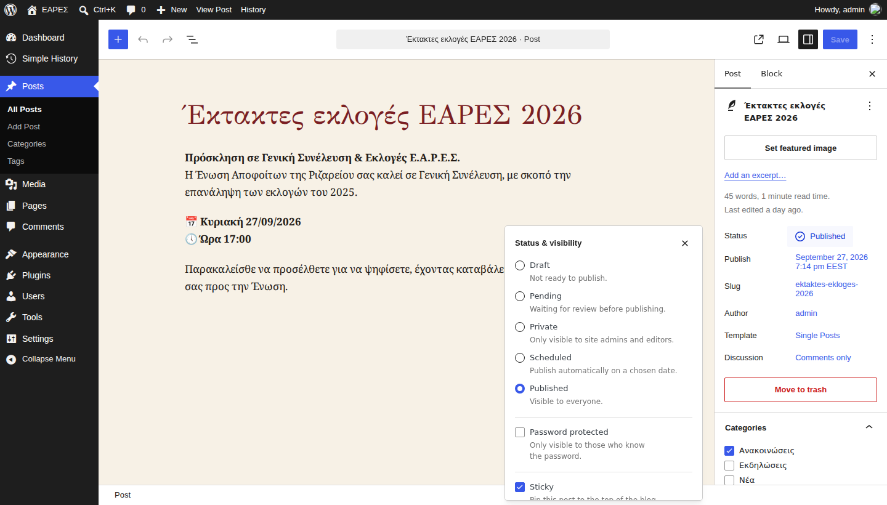

### Νέο φύλλο του «Ριζαρείτη»

1. Νέο άρθρο με τίτλο π.χ. **Ο Ριζαρείτης — Φύλλο 133**, κατηγορία **Ο Ριζαρείτης**.
2. **Εικόνα άρθρου**: το πρωτοσέλιδο (φωτογραφία ή εικόνα της πρώτης σελίδας). Εμφανίζεται στην αρχική σελίδα.
3. Στο κείμενο, λίγα λόγια για τα περιεχόμενα του φύλλου.
4. Για το PDF: πατήστε το **+** για νέο μπλοκ, γράψτε **Αρχείο** (File) και διαλέξτε το. Στο μπλοκ πατήστε **Μεταφόρτωση** (Upload) και διαλέξτε το PDF από τον υπολογιστή σας.
5. **Δημοσίευση**.

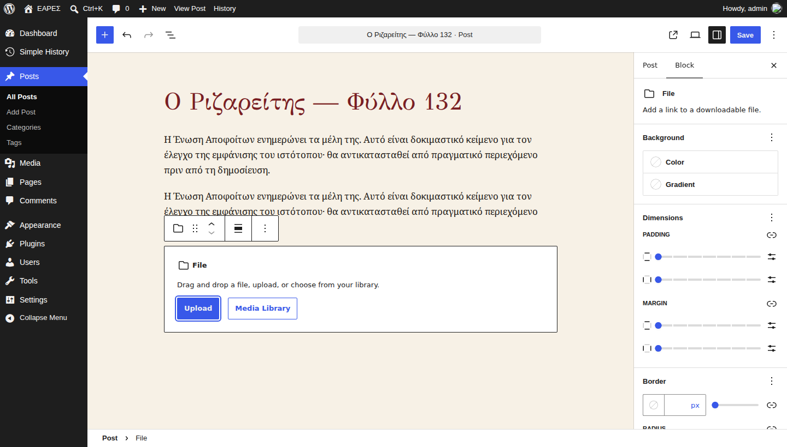

### Περιεχόμενο μόνο για μέλη

Ό,τι δεν είναι για το ευρύ κοινό (πρακτικά ΔΣ, ενημερώσεις προς τα μέλη) το βλέπουν μόνο τα **συνδεδεμένα μέλη**.

#### Άρθρο ή σελίδα μόνο για μέλη

1. Στη δεξιά στήλη, πατήστε δίπλα στην **Κατάσταση** (Status).
2. Διαλέξτε **Ιδιωτικό** (Private) και πατήστε **Αποθήκευση** (Save).

Η περιγραφή κάτω από το «Ιδιωτικό» λέει ότι το βλέπουν μόνο οι διαχειριστές. Είναι το γενικό κείμενο του WordPress: στην ΕΑΡΕΣ το βλέπουν **και τα μέλη**.

Το άρθρο εμφανίζεται πλέον στα Νέα **μόνο σε όσους έχουν συνδεθεί**, με την πράσινη ετικέτα **Μόνο για μέλη**. Οι επισκέπτες δεν το βλέπουν καθόλου, ούτε και οι μηχανές αναζήτησης.

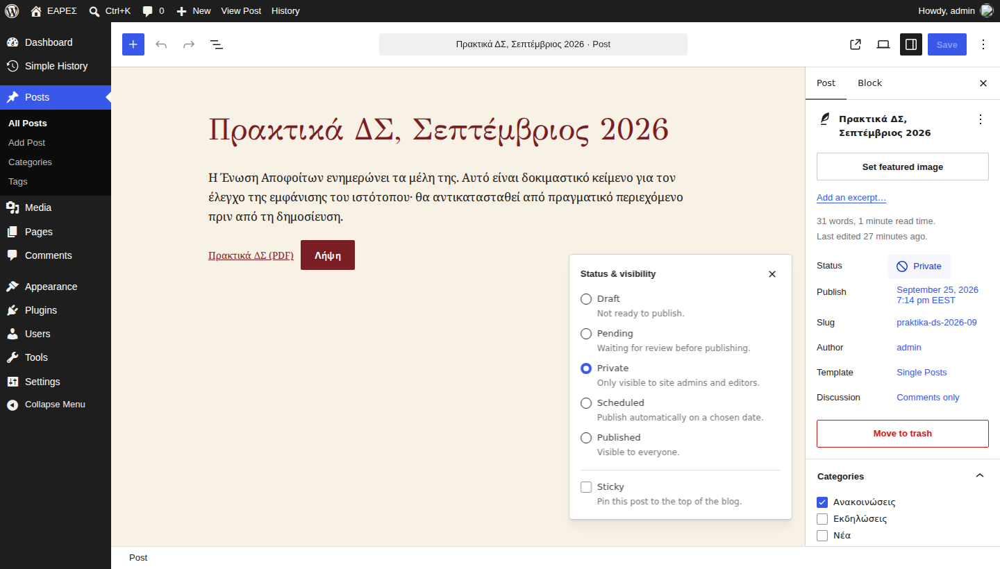

#### Αρχείο μόνο για μέλη

Ένα PDF μέσα σε ιδιωτικό άρθρο **δεν** κρύβεται μόνο του. Όποιος έχει τον σύνδεσμο μπορεί να το ανοίξει. Για να το κρύψετε:

1. Αριστερά πατήστε **Πολυμέσα** (Media) και ανοίξτε το αρχείο.
2. Τσεκάρετε **Μόνο για μέλη** και πατήστε **Ενημέρωση** (Update).

Από εκεί και πέρα το αρχείο ανοίγει **μόνο σε συνδεδεμένα μέλη**. Οι υπόλοιποι οδηγούνται στη σελίδα σύνδεσης.

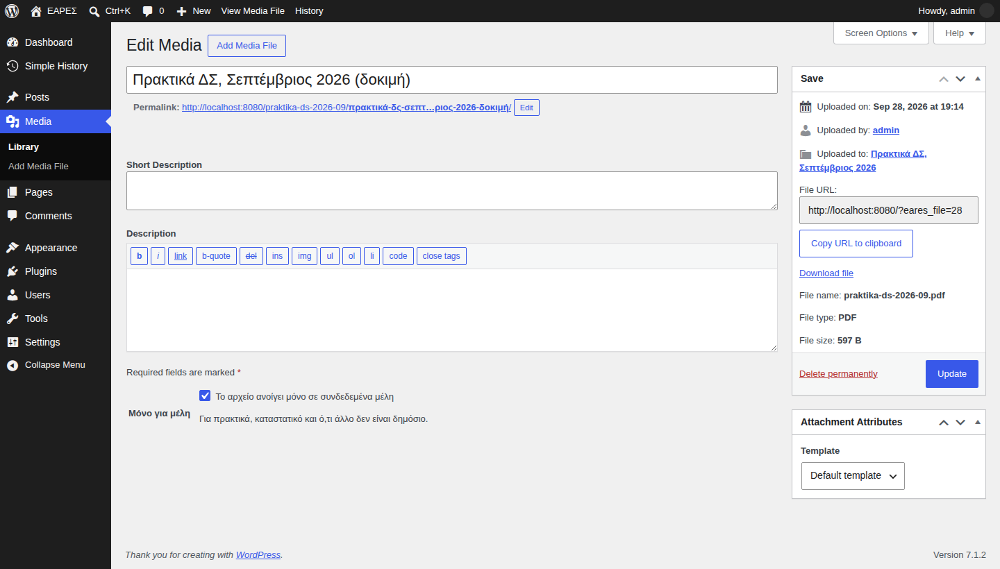

Δεν έχει σημασία αν το κάνετε πριν ή αφού βάλετε το αρχείο σε άρθρο: οι σύνδεσμοι στα άρθρα ενημερώνονται μόνοι τους. Το ίδιο ισχύει κι αν αργότερα το ξετσεκάρετε.

### Έτοιμα μπλοκ της ΕΑΡΕΣ (μοτίβα)

Πατήστε το **+** επάνω αριστερά, καρτέλα **Μοτίβα** (Patterns), κατηγορία **ΕΑΡΕΣ**:

| Μοτίβο | Για |
|---|---|
| **Διοικητικό Συμβούλιο** | Πλέγμα με φωτογραφίες και ονόματα των μελών του ΔΣ. Αλλάζετε φωτογραφίες και ονόματα. |
| **Διαχωριστικό με σταυρό** | Διακοσμητική γραμμή ανάμεσα σε ενότητες. |
| **Πρόσκληση για συνδρομή** | Η πράσινη λωρίδα «Ανανεώστε τη συνδρομή σας». |

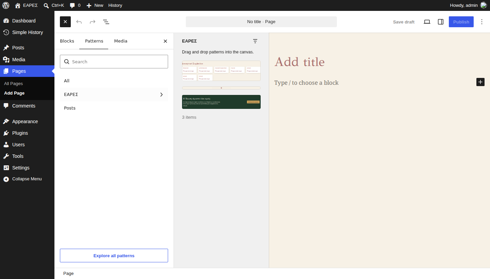

### Σελίδες και τα «Προς συμπλήρωση»

Οι σελίδες του μενού φτιάχτηκαν με κείμενα που λείπουν. Όπου λείπει κάτι, υπάρχει μια παράγραφος σε πλάγια γράμματα: *[Προς συμπλήρωση: …]*.

1. **Σελίδες** (Pages) → πατήστε το όνομα της σελίδας.
2. Αντικαταστήστε την παράγραφο «Προς συμπλήρωση» με το πραγματικό κείμενο.
3. **Ενημέρωση** (Save).

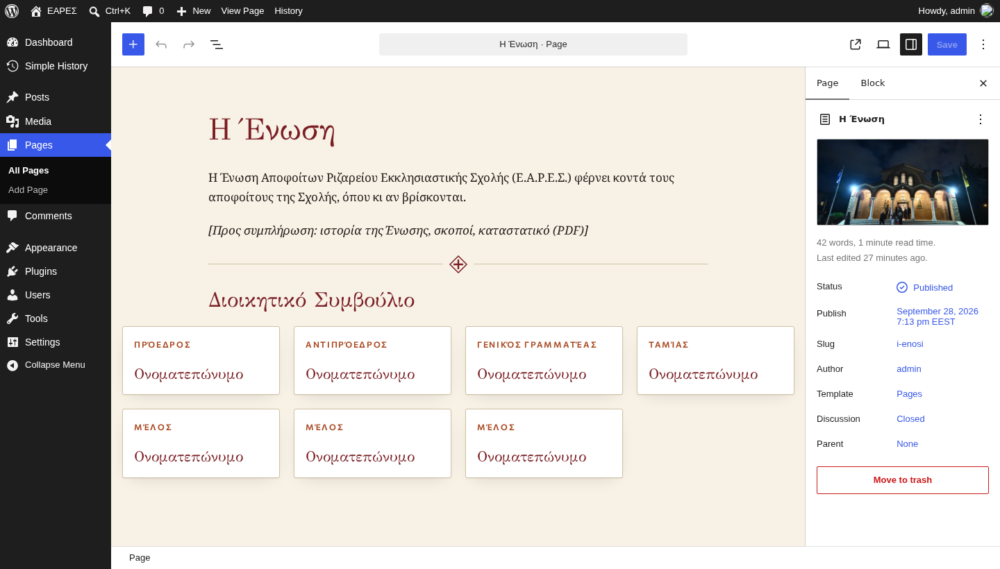

> Μη διαγράφετε σελίδες του μενού και μην αλλάζετε τη διεύθυνσή τους (slug). Το μενού τις βρίσκει από εκεί.

### Σχόλια

Αν ένα άρθρο δέχεται σχόλια, τα νέα σχόλια περιμένουν έγκριση στα **Σχόλια** (Comments). Πατήστε **Έγκριση** (Approve) ή **Ανεπιθύμητο** (Spam).

---

### Καλές πρακτικές

- **Ένας τίτλος, μία είδηση.** Σύντομοι τίτλοι, χωρίς κεφαλαία παντού.
- **Ημερομηνίες και ώρες** πάντα μέσα στο κείμενο των εκδηλώσεων: «Κυριακή 27 Σεπτεμβρίου 2026, 17:00».
- **Φωτογραφίες με πρόσωπα**: δημοσιεύστε μόνο αν οι εικονιζόμενοι το δέχονται.
- **Ό,τι αφορά μόνο τα μέλη** (ονόματα, τηλέφωνα, οικονομικά): πάντα **Ιδιωτικό**, και τα αρχεία **Μόνο για μέλη**.
- Κάτι πήγε στραβά; Κάθε άρθρο κρατά **Αναθεωρήσεις** (Revisions) στη δεξιά στήλη: μπορείτε να γυρίσετε σε προηγούμενη μορφή.

---

## Μέρος Β: Λογαριασμοί

### Η οθόνη Χρήστες

**Χρήστες** (Users) στο μενού αριστερά. Εκτός από τα συνηθισμένα, δείχνει δύο στήλες της ΕΑΡΕΣ:

- **2FA**: ✔ Ενεργό ή — Όχι.
- **Τελευταία σύνδεση**: με κόκκινη σήμανση **12+ μήνες** για όσους δεν έχουν συνδεθεί εδώ και έναν χρόνο.

Και οι δύο ταξινομούνται με ένα κλικ στον τίτλο της στήλης.

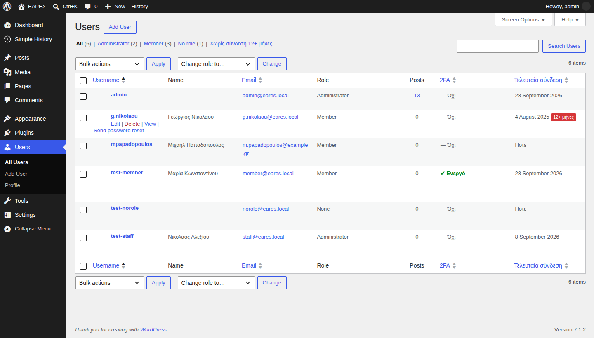

### Νέα μέλη: γράφονται μόνα τους

Τα μέλη **εγγράφονται μόνα τους** από τον σύνδεσμο **Εγγραφή** και γίνονται αμέσως **Μέλη**. Δεν χρειάζεται έγκριση.

Για κάθε νέα εγγραφή λαμβάνετε **email**. Η εγγραφή καταγράφεται και στο **Ιστορικό** (Simple History) μαζί με το έτος αποφοίτησης.

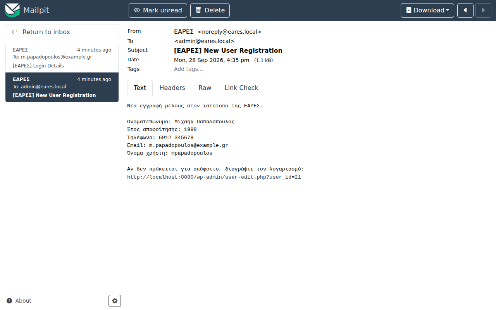

> **Να ξέρετε:** αφού η εγγραφή είναι ελεύθερη, το «μόνο για μέλη» σημαίνει «μόνο για όσους έχουν λογαριασμό». Κρατά το περιεχόμενο μακριά από τους περαστικούς και τις μηχανές αναζήτησης, όχι από όποιον φτιάξει λογαριασμό. Γι' αυτό **ρίχνετε μια ματιά στις νέες εγγραφές**: άγνωστο όνομα ή απίθανο έτος αποφοίτησης; Διαγράψτε τον (πιο κάτω).

### Νέος διαχειριστής

1. **Χρήστες → Προσθήκη νέου** (Users → Add New User).
2. Όνομα χρήστη, email, όνομα και επώνυμο.
3. **Ρόλος** (Role): **Διαχειριστής** (Administrator).
4. Αφήστε τσεκαρισμένο το **Αποστολή ειδοποίησης** (Send User Notification): του έρχεται email για να ορίσει κωδικό.
5. **Προσθήκη νέου χρήστη** (Add New User).

Αν έχει ήδη λογαριασμό μέλους, απλώς αλλάξτε τον **Ρόλο** του σε Διαχειριστή. Δώστε του αυτόν τον οδηγό και ζητήστε του να ενεργοποιήσει το 2FA την ίδια μέρα.

Όταν κάποιος **φεύγει** από την ομάδα, αλλάξτε τον ρόλο του σε **Μέλος** (αν είναι απόφοιτος) ή διαγράψτε τον λογαριασμό.

### Διαγραφή λογαριασμού

Για ψεύτικες εγγραφές ή για όποιον ζητήσει να φύγει:

1. **Χρήστες** → περάστε τον δείκτη πάνω από το όνομα → **Διαγραφή** (Delete).
2. Αν ο λογαριασμός έχει γράψει άρθρα, επιλέξτε **Απόδοση όλου του περιεχομένου σε** (Attribute all content to) έναν άλλο διαχειριστή, ώστε τα άρθρα να μείνουν.
3. **Επιβεβαίωση διαγραφής** (Confirm Deletion).

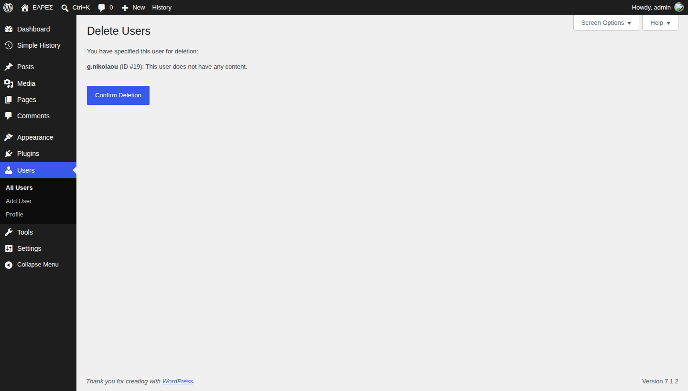

> Θέλετε να κλειδώσετε κάποιον **προσωρινά**, χωρίς να τον σβήσετε; Στη σελίδα του χρήστη, **Ρόλος** → **— Κανένας ρόλος για αυτόν τον ιστότοπο —** (No role for this site). Αποσυνδέεται αμέσως και δεν μπορεί να ξαναμπεί μέχρι να του δώσετε ξανά ρόλο.

### Λογαριασμοί που δεν χρησιμοποιούνται

Επάνω από τη λίστα πατήστε **Χωρίς σύνδεση 12+ μήνες**. Βλέπετε μόνο όσους δεν έχουν συνδεθεί εδώ και έναν χρόνο. **Δεν γίνεται τίποτα αυτόματα.** Αποφασίζετε εσείς: τους αφήνετε, τους διαγράφετε.

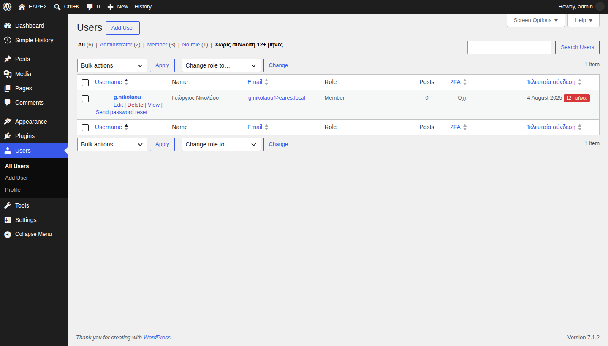

Συνιστάται ένας έλεγχος **μία φορά τον χρόνο**, ιδίως για **διαχειριστές**. Ένας ξεχασμένος λογαριασμός που μπορεί να κάνει τα πάντα είναι κίνδυνος.

### Κάποιος έχασε το κινητό του (επαναφορά 2FA)

1. **Χρήστες** → περάστε τον δείκτη πάνω από το όνομα → **Επαναφορά 2FA**.
2. Επιβεβαιώστε.

Ο χρήστης μπαίνει πλέον **μόνο με τον κωδικό** του και ξαναενεργοποιεί το 2FA από το προφίλ του. Λαμβάνει ενημερωτικό **email**, και η επαναφορά καταγράφεται στο Ιστορικό.

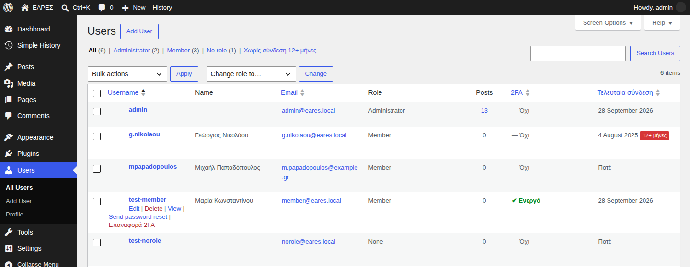

> **Πριν την επαναφορά, βεβαιωθείτε ποιος ζητά.** Κλείστε το τηλέφωνο και καλέστε εσείς πίσω στο τηλέφωνο **του προφίλ του**, ποτέ σε αριθμό που σας έδωσαν στην κλήση. Η επαναφορά αφήνει τον λογαριασμό προστατευμένο μόνο με τον κωδικό, και αυτό ακριβώς επιδιώκει όποιος έχει κλέψει έναν κωδικό.

Το δικό σας 2FA δεν μπορείτε να το επαναφέρετε μόνοι σας. Το κάνει **άλλος διαχειριστής**, με τον ίδιο έλεγχο ταυτότητας. Γι' αυτό φυλάτε τους **κωδικούς ανάκτησης**.

### Ιστορικό δραστηριότητας

**Πίνακας ελέγχου → Ιστορικό** (Simple History). Εδώ φαίνονται συνδέσεις, αποτυχημένες προσπάθειες, κλειδώματα, νέες εγγραφές, αλλαγές ρόλων, διαγραφές, επαναφορές 2FA και αλλαγές περιεχομένου. Το βλέπουν **μόνο** οι διαχειριστές.


### Προσωπικά δεδομένα (GDPR)

Αν κάποιος ζητήσει αντίγραφο ή διαγραφή των στοιχείων του:

- **Εργαλεία → Εξαγωγή προσωπικών δεδομένων** (Tools → Export Personal Data): αρχείο με όλα τα στοιχεία του, μαζί με το **τηλέφωνο** και το **έτος αποφοίτησης**.
- **Εργαλεία → Διαγραφή προσωπικών δεδομένων** (Tools → Erase Personal Data): τα σβήνει.

Γράφετε το email του, πατήστε **Αποστολή αιτήματος** (Send Request). Ο ιστότοπος του στέλνει email για επιβεβαίωση, και μετά ολοκληρώνετε το αίτημα από την ίδια οθόνη.

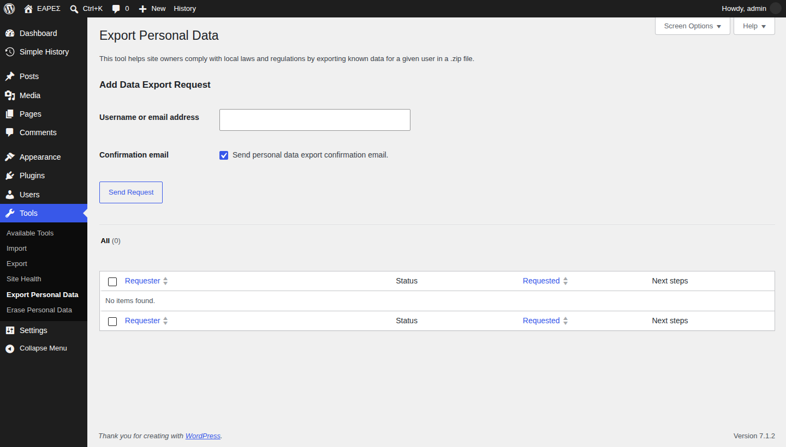

Για πλήρη διαγραφή του λογαριασμού: **Χρήστες** → **Διαγραφή** (Delete), και αποδώστε τα άρθρα του σε άλλον χρήστη αν έχει γράψει.

### «Πάρα πολλές αποτυχημένες προσπάθειες»

Μετά από **5** λάθος κωδικούς για ένα όνομα χρήστη από την ίδια σύνδεση (ή **20** συνολικά από μία σύνδεση), η σύνδεση κλειδώνει για **15 λεπτά**, ακόμη και με σωστό κωδικό. Το κλείδωμα φαίνεται στο Ιστορικό. Ο χρήστης απλώς περιμένει ή ζητά νέο κωδικό.

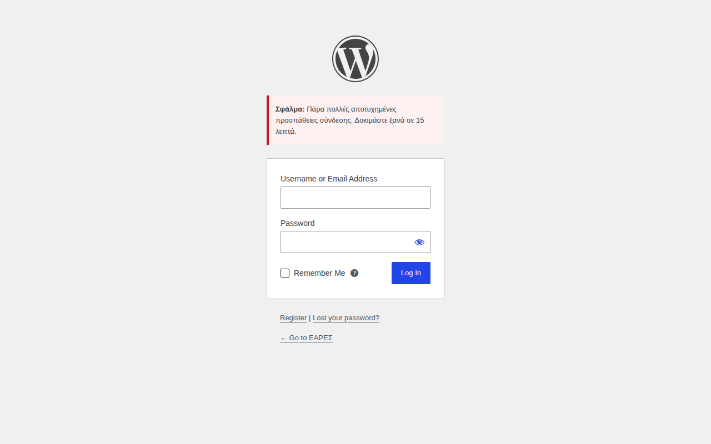

> Αν **όλοι** κλειδώνονται μαζί, ο ιστότοπος πιθανόν βρίσκεται πίσω από reverse proxy και βλέπει όλους με την ίδια IP. Δείτε το `TRUST_PROXY` στο Μέρος Β.

---

## Μέρος Γ: Τεχνική λειτουργία

> Για όποιον έχει πρόσβαση στον **server**. Οι υπόλοιποι διαχειριστές μπορούν να παραλείψουν αυτό το μέρος.

Όλα τα παρακάτω γίνονται από τον φάκελο του έργου στον server. Ο πίνακας ελέγχου **δεν** μπορεί να εγκαταστήσει ή να ενημερώσει κώδικα. Αυτό είναι σκόπιμο (δείτε το [README](../README.md)).

### Κάθε μήνα: αντίγραφο και ενημέρωση

```sh
scripts/backup.sh
scripts/update.sh
```

Και **αμέσως** όταν βγει ενημέρωση ασφαλείας του WordPress.

- Το `backup.sh` γράφει τη βάση και τα ανεβασμένα αρχεία στον φάκελο `backups/`. **Αντιγράψτε τα εκτός server.** Αντίγραφο που μένει δίπλα στο πρωτότυπο δεν είναι αντίγραφο.
- Το `update.sh` ενημερώνει το WordPress, τα πρόσθετα και τις μεταφράσεις.

Τα αρχεία **μόνο για μέλη** (`uploads/eares-members/`) περιλαμβάνονται στο αντίγραφο.

### Επαναφορά από αντίγραφο

```sh
set -a; source .env; set +a
gunzip -c backups/db-<ώρα>.sql.gz \
  | docker compose exec -T -e MYSQL_PWD="$DB_ROOT_PASSWORD" db mariadb -uroot "$DB_NAME"
docker compose exec -T -u www-data wordpress tar -C /var/www/html/wp-content -xz \
  < backups/uploads-<ώρα>.tar.gz
```

Δοκιμάστε την επαναφορά **μία φορά** σε υπολογιστή δοκιμών, πριν τη χρειαστείτε στ' αλήθεια.

### Αλλαγή ρόλων ή κώδικα

1. Αλλάξτε τον κώδικα στο git (π.χ. `eares-roles.php`).
2. Αν αλλάξατε δικαιώματα ρόλων, αυξήστε το `EARES_ROLES_VERSION`.
3. Τρέξτε τους ελέγχους (`scripts/smoke-test.sh`), κάντε commit και ανεβάστε στον server.

### Ρυθμίσεις στο `.env`

| Ρύθμιση | Πότε |
|---|---|
| `SMTP_*` | Ο πάροχος email. Χωρίς σωστό email δεν φτάνουν οι σύνδεσμοι εγγραφής, οι κωδικοί και ο κωδικός 2FA με email. |
| `TRUST_PROXY=1` | **Μόνο** αν μπροστά από το WordPress υπάρχει δικός σας reverse proxy. Αλλιώς όλοι φαίνονται με την IP του proxy και κλειδώνονται μαζί. |
| `FORCE_SSL_ADMIN=1` | Μόλις ο ιστότοπος σερβίρεται με HTTPS. |
| `WP_ENVIRONMENT_TYPE=production` | Στον πραγματικό server. Τότε τα scripts αρνούνται τους κωδικούς `change-me` και τα δοκιμαστικά δεδομένα. |

> **Αρχεία μόνο για μέλη και web server:** η προστασία του φακέλου `uploads/eares-members/` βασίζεται σε αρχείο `.htaccess`, που το διαβάζει ο **Apache** του Docker image. Αν ποτέ βάλετε **nginx** μπροστά να σερβίρει απευθείας τα uploads, πρέπει να απαγορεύσετε κι εκεί τη διαδρομή `/wp-content/uploads/eares-members/`.

### Πριν τον πρώτο «ζωντανό» ιστότοπο

- [ ] Πάροχος SMTP ρυθμισμένος και δοκιμασμένος (μια δοκιμαστική εγγραφή φτάνει στα εισερχόμενα;).
- [ ] `WP_ENVIRONMENT_TYPE=production`, `blog_public=1` και **όλοι** οι κωδικοί `change-me` αλλαγμένοι.
- [ ] HTTPS και `FORCE_SSL_ADMIN=1`. Με reverse proxy, και `TRUST_PROXY=1`.
- [ ] Τουλάχιστον δύο διαχειριστές, όλοι με 2FA.
- [ ] Νυχτερινό `scripts/backup.sh` (cron) με αντιγραφή εκτός server.
- [ ] Το `scripts/update.sh` στο ημερολόγιο, κάθε μήνα.
- [ ] Τα «Προς συμπλήρωση» των σελίδων συμπληρωμένα (ιστορία, ΔΣ, συνδρομή και IBAN, επικοινωνία).
- [ ] Έλεγχος ότι η ελληνική μετάφραση του Two-Factor είναι πλήρης.
