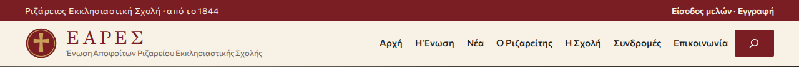
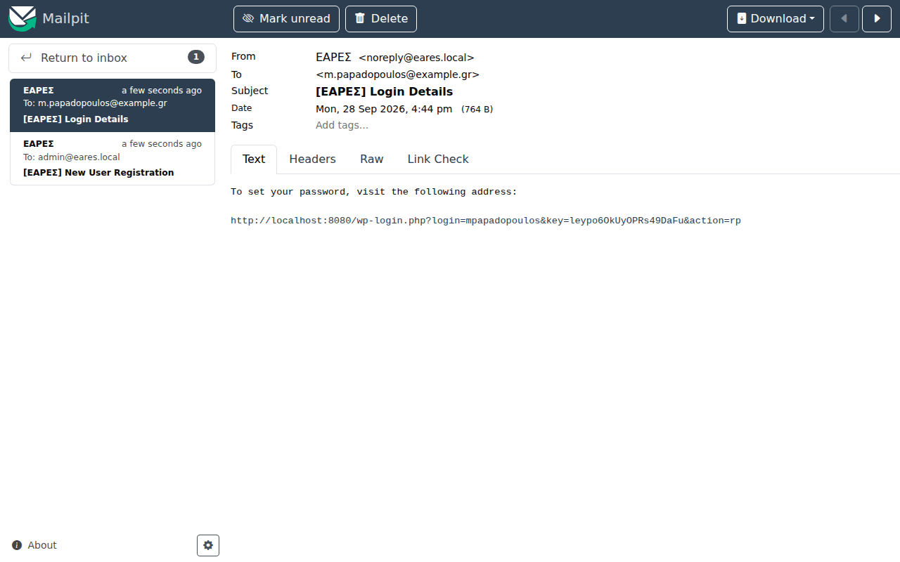
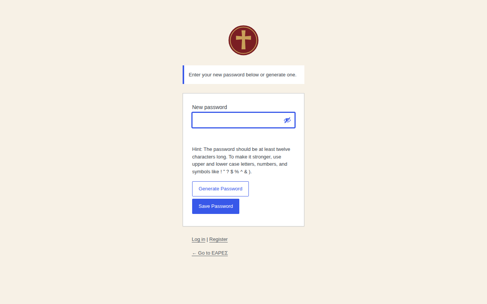
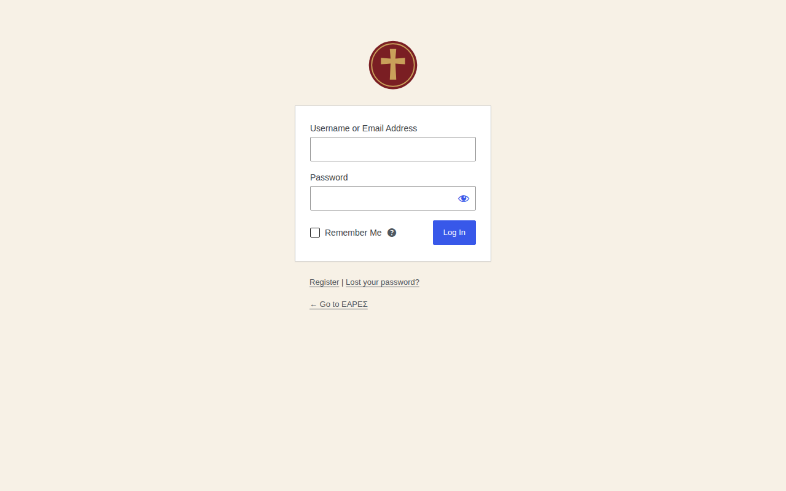
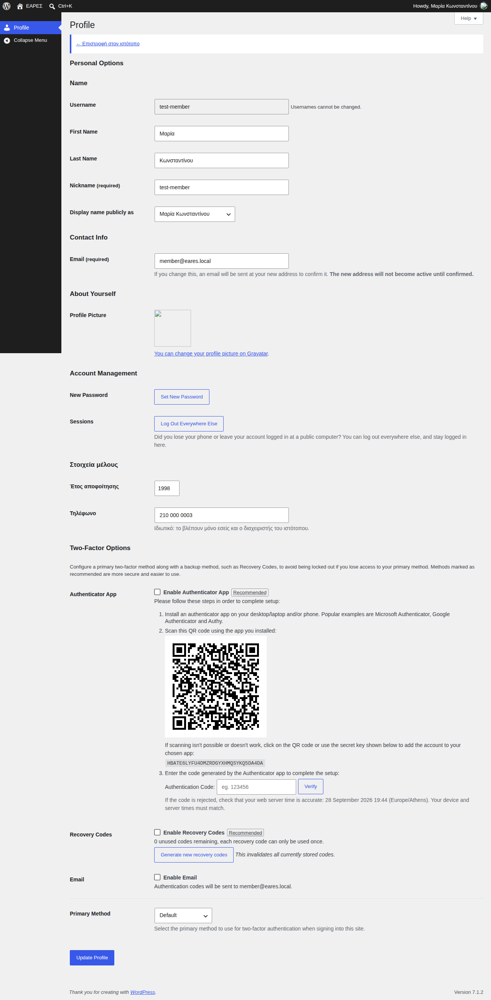
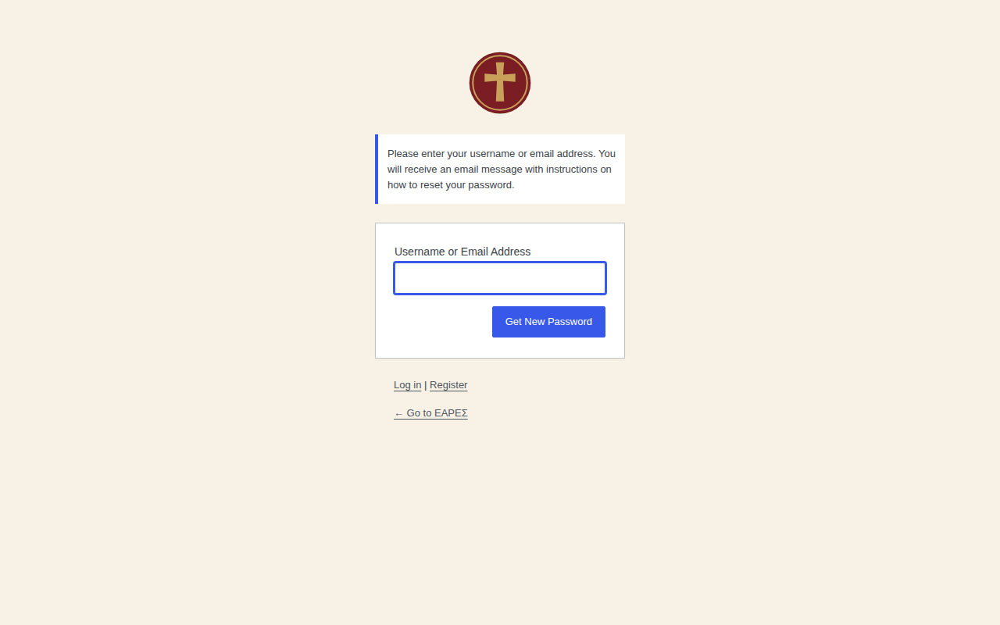

# Οδηγός για τα μέλη της ΕΑΡΕΣ

> Για αποφοίτους της Ριζαρείου που θέλουν λογαριασμό στον ιστότοπο της Ένωσης.
> Οι ονομασίες των κουμπιών δίνονται στα ελληνικά. Στην παρένθεση φαίνεται η αγγλική ονομασία, αν η οθόνη σας είναι στα αγγλικά.

## Τι κερδίζω με λογαριασμό;

Ο ιστότοπος είναι ανοιχτός σε όλους. Με λογαριασμό μέλους βλέπετε **επιπλέον**:

- άρθρα και σελίδες **μόνο για μέλη**, όπως πρακτικά του ΔΣ και ενημερώσεις προς τα μέλη·
- αρχεία **μόνο για μέλη** (PDF), όπως το καταστατικό.

Επίσης κρατάτε ενημερωμένα τα στοιχεία σας (email, τηλέφωνο), ώστε η Ένωση να μπορεί να επικοινωνεί μαζί σας.

- Η εγγραφή είναι **δωρεάν** και γίνεται **αμέσως**, χωρίς έγκριση.
- Χρειάζεστε **περίπου 5 λεπτά** και ένα email που ελέγχετε.

---

## Βήμα 1: Ανοίξτε τη φόρμα εγγραφής

1. Μπείτε στον ιστότοπο της ΕΑΡΕΣ.
2. Στην κόκκινη λωρίδα επάνω δεξιά πατήστε **Εγγραφή**.

## Βήμα 2: Συμπληρώστε τη φόρμα

| Πεδίο | Τι γράφετε |
|---|---|
| **Όνομα χρήστη** (Username) | Ένα όνομα για τη σύνδεση, με λατινικούς χαρακτήρες, π.χ. `gpapadopoulos`. **Δεν φαίνεται πουθενά δημόσια.** |
| **Email** | Το email σας. Εκεί θα έρθει ο σύνδεσμος για τον κωδικό. |
| **Όνομα** και **Επώνυμο** | Όπως θέλετε να εμφανίζεστε. |
| **Έτος αποφοίτησης** | Π.χ. `1998`. |
| **Τηλέφωνο** | Προαιρετικό. |

Το τηλέφωνο και το έτος αποφοίτησης **τα βλέπετε μόνο εσείς και ο διαχειριστής** του ιστότοπου.

Πατήστε **Εγγραφή** (Register).

## Βήμα 3: Ορίστε τον κωδικό σας από το email

1. Σε λίγα λεπτά λαμβάνετε email από την **ΕΑΡΕΣ**. Αν δεν το βλέπετε, κοιτάξτε και στα **Ανεπιθύμητα** (Spam).
2. Πατήστε τον σύνδεσμο μέσα στο μήνυμα.

3. Ανοίγει μια σελίδα με έναν **προτεινόμενο κωδικό**. Μπορείτε να τον κρατήσετε ή να γράψετε δικό σας.
   Ένας καλός κωδικός είναι μεγάλος: π.χ. τέσσερις άσχετες λέξεις μαζί.
4. Πατήστε **Αποθήκευση κωδικού** (Save Password).

**Τέλος!** Είστε πλέον μέλος.

> Ο σύνδεσμος του email ισχύει για λίγο καιρό. Αν έληξε, ακολουθήστε το «Ξέχασα τον κωδικό μου» πιο κάτω.

---

## Πώς συνδέομαι

1. Στην κόκκινη λωρίδα επάνω δεξιά πατήστε **Είσοδος μελών**.
2. Γράψτε το **όνομα χρήστη** (ή το email σας) και τον **κωδικό** σας.
3. Πατήστε **Σύνδεση** (Log In).

Μετά τη σύνδεση επιστρέφετε στην αρχική σελίδα. Επάνω δεξιά βλέπετε πλέον **Το προφίλ μου** και **Αποσύνδεση**.

> Σε κοινόχρηστο υπολογιστή, όταν τελειώσετε, πατήστε πάντα **Αποσύνδεση**.

## Πού βρίσκω το περιεχόμενο για τα μέλη

Τα άρθρα για τα μέλη εμφανίζονται **μαζί με τα υπόλοιπα**, στα **Νέα** και στην αρχική σελίδα. Ξεχωρίζουν από την πράσινη ετικέτα **Μόνο για μέλη** δίπλα στον τίτλο.

Τα αρχεία (PDF) ανοίγουν όπως όλα τα αρχεία: πατήστε τον σύνδεσμο ή το κουμπί **Λήψη**.

> Αν κάποιος σας στείλει σύνδεσμο προς άρθρο ή αρχείο για μέλη ενώ δεν είστε συνδεδεμένοι, θα δείτε «Η σελίδα δεν βρέθηκε» ή τη σελίδα σύνδεσης. **Συνδεθείτε και ανοίξτε ξανά τον σύνδεσμο.**

## Τα στοιχεία μου (προφίλ)

1. Επάνω δεξιά πατήστε **Το προφίλ μου**.
2. Μπορείτε να αλλάξετε:
   - το **email** σας (θα σας έρθει email επιβεβαίωσης στη νέα διεύθυνση)·
   - το **όνομα** και το **επώνυμο**, και πώς εμφανίζεστε·
   - το **έτος αποφοίτησης** και το **τηλέφωνο**, στην ενότητα **Στοιχεία μέλους**·
   - τον **κωδικό** σας, με το κουμπί **Ορισμός νέου κωδικού** (Set New Password).
3. Πατήστε **Ενημέρωση προφίλ** (Update Profile) στο τέλος της σελίδας.
4. Για να γυρίσετε στον ιστότοπο, πατήστε **← Επιστροφή στον ιστότοπο** επάνω στη σελίδα.

## Επαλήθευση δύο βημάτων (προαιρετική)

Αν θέλετε ακόμη μεγαλύτερη ασφάλεια, μπορείτε να ζητάτε και έναν κωδικό από το κινητό σας σε κάθε σύνδεση. Δείτε τον ξεχωριστό οδηγό: [**Επαλήθευση δύο βημάτων (2FA)**](2fa-odigos.md).

## Ξέχασα τον κωδικό μου

1. Στη σελίδα σύνδεσης πατήστε **Ξεχάσατε τον κωδικό σας;** (Lost your password?).
2. Γράψτε το **όνομα χρήστη** ή το **email** σας και πατήστε **Λήψη νέου κωδικού** (Get New Password).
3. Θα λάβετε email με σύνδεσμο. Συνεχίστε όπως στο **Βήμα 3** της εγγραφής.

---

## Συχνές ερωτήσεις

**Γράφω σωστό κωδικό αλλά μου λέει «Πάρα πολλές αποτυχημένες προσπάθειες».**
Μετά από 5 λάθος κωδικούς η σύνδεση κλειδώνει για 15 λεπτά, για προστασία από όσους μαντεύουν κωδικούς. Περιμένετε και δοκιμάστε ξανά, ή ζητήστε νέο κωδικό.

**Μου λέει «Ο λογαριασμός σας δεν είναι ενεργός».**
Ο λογαριασμός έχει απενεργοποιηθεί. Επικοινωνήστε με τον διαχειριστή του ιστότοπου.

**Μου λέει «Πάρα πολλές εγγραφές από αυτή τη σύνδεση».**
Από το ίδιο δίκτυο επιτρέπονται λίγες εγγραφές την ώρα (π.χ. σε ένα γραφείο). Δοκιμάστε ξανά αργότερα.

**Μπορώ να γράψω κι εγώ άρθρο;**
Στείλτε το κείμενο και τις φωτογραφίες σας στην Ένωση (δείτε τη σελίδα **Επικοινωνία**). Τη δημοσίευση την κάνουν οι διαχειριστές του ιστότοπου.

**Θέλω να διαγραφεί ο λογαριασμός μου και τα στοιχεία μου.**
Επικοινωνήστε με τον διαχειριστή του ιστότοπου. Θα διαγράψει τον λογαριασμό και τα προσωπικά σας στοιχεία.
